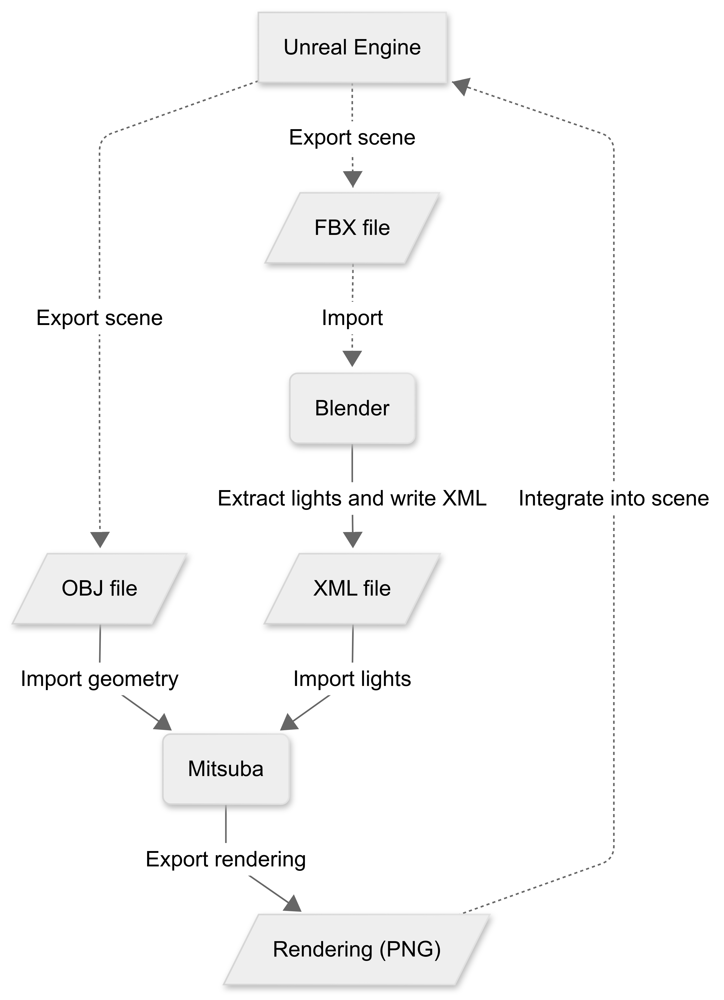

# Mitsuba Rendering from Unreal Engine Export

This project allows you to:
- Export light positions from a **Blender** scene (originally imported from Unreal Engine).
- Render the 3D scene with **Mitsuba 3** using those lights.
- Save the results as **PNG images** and **compressed HDF5** files.
- Visualize all the rendered images easily.

# Installation
This project was developed in Python 3.12, the compatibility with other versions cannot be guaranteed.

To install a ```requirements.txt``` is provided and the modules can be installed by
```bash
pip install -r requirements.txt
```

# Project Structure
```bash
.
├── README.md
├── demo.ipynb               <- demo noteboook
├── demo_scene               <- contains demo scene objs and xmls
│   ├── scene10.obj
│   ├── scene10.xml
│   ├── scene11.obj
│   └── scene11.xml
├── images
│   └── workflow.png        <- workflow image for README
├── requirements.txt        <- pip requirements to install
├── src
│   ├── blender_export.py  <- script to run in Blender to extract lights and write xml
│   └── mitsuba_render_h5.py  <- renders a directory of scenes and saves as PNGs and HDF5
└── tests
    └── test_mitsuba_render_h5.py

```

# Use
The use of ```mitsuba_render_h5.py``` is relatively straightforward and also illustrated in ```demo.ipynb```: 

One can either run
```python
from src.mitsuba_render_h5 import render_scene
```
in another Python file or run ```mitsuba_render_h5.py``` in the command line by running e.g.

```bash
python src/mitsuba_render_h5.py --scene_dir demo_scene --out_path demo_scene
```
with the current working directory as defaults for the arguments ```--scene_dir``` and ```--out_file```.

This will save the rendered png files, as well as the combined HDF5 file in the out_path directory

# Workflow
